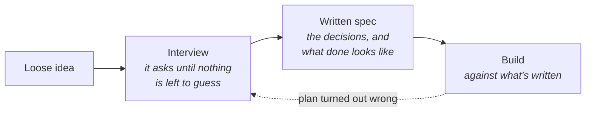

# Deciding before building

No builder pours the foundation to find out where the kitchen goes. The drawings come first, the
client argues with them, and only then does anyone order concrete. The expensive part of building
is the week-twelve discovery that "open plan" meant something different to each person. Agents
made the bricklaying cheap. That discovery still costs the same.

**In this module:**

- Why a vague brief gets a confident guess instead of a question
- How shared understanding replaced the prompting tricks
- What changing your mind costs, and when to go look instead of plan
- How to keep deciding and building apart

## A vague brief gets a confident guess

**A person who doesn't understand a task asks about it. An agent picks one reading and builds it.**

- Give it something vague and it picks one interpretation without telling you, then builds it
  well. You get a professional answer to a question you didn't ask.
- The risk is good code for the wrong thing, and that code passes review.
- Watch for the words that show a guess: "I assumed...", "typically this would...". Each marks a
  decision the agent closed for you.
- "Make it nice and clean" leaves every decision open. "Never more than three clicks to create
  an order" closes one.

In plain terms: you're done deciding when a stranger can build the right thing from what you
wrote down.

## What replaced the prompting tricks

**Clever wording stopped mattering. Shared understanding decides the outcome.**

You used to assign the model a role, or tell it to think step by step. Those moves were
workarounds for models that filled gaps badly, and they expired as the models improved. What
still matters is that you and the agent want the same thing. The way there is the requirements
meeting, where someone asks questions until the vagueness is gone. Now the agent asks them.

- **Start with the map when the work is big.** [`wayfinder`](../skills/wayfinder/SKILL.md) charts the decisions a long piece
  of work needs, then settles them one session at a time. On anything running for weeks, start
  here rather than with a single interview.
- **Let it interview you.** [`grill-me`](../skills/grill-me/SKILL.md) works through the open decisions one question at a time
  and proposes an answer to each, so you're mostly saying yes or no. A good interviewer raises
  angles you hadn't considered.
- **Then write it down.** [`to-spec`](../skills/to-spec/SKILL.md) turns the answers into a spec, and [`to-issues`](../skills/to-issues/SKILL.md) cuts it into
  tickets. Written decisions travel to tomorrow's session and to whoever checks the work. When the
  spec needs a person to sign it off, send them the spec issue itself: it reads on GitHub without
  opening the repo.
- **Let the ticket carry "done".** Write what must be true at the end, and where the work would
  realistically break. Otherwise a reader can't tell finished from abandoned.

## What changing your mind costs

**A decision gets more expensive to change the further it has travelled.**

| Change your mind | What it costs | What you're editing |
|---|---|---|
| While deciding | Minutes | A sentence in a document |
| Mid-build | Hours, plus the work already done the old way | Code that exists |
| After shipping | Days, and rarely code alone | Live data, and what's built on it |

Agents changed the middle row and left the others alone. Writing code got much cheaper, while
migrating live data and unpicking the code around the old shape cost what they did before. If a
wrong guess costs two minutes, a ten-minute interview is waste; throwaway work can stay vague.

## Go look when you can't describe it

**You can't specify some work up front, because you don't know what you want until you see it.**

Planning anyway hides the uncertainty inside tickets that look precise.

- If you can't answer "how should this feel?" in words, ask for something to click: one
  disposable file you open in a browser ([`prototype`](../skills/prototype/SKILL.md)).
- Answer questions of fact before you plan. Look up what an API returns instead of guessing
  inside a ticket. Where the approach itself is unsettled, [`research`](../skills/research/SKILL.md) chases the question
  back to primary sources in a background agent and writes it up with citations you can check.
- When the work is too big to hold in your head, settle the open decisions one at a time
  (`wayfinder`).

Work you've done ten times before needs none of this.

## Decide, then build

**Deciding and building are different modes, and blending them ruins both.**

If the agent doing the work can also renegotiate what the work *is*, every surprise gives it two
bad options. It can change the goal or work around it, out of sight, mid-build. This has been
measured: agents carry out a specified change reliably, and are much weaker at choosing which
change to make.

Our build flow has two steps on purpose. The first reads the ticket, checks its claims against
the live code, and sets up the workspace ([`pickup-issue`](../skills/pickup-issue/SKILL.md)). The second builds without reopening it
([`implement`](../skills/implement/SKILL.md)). A mid-build "wouldn't it be better if..." goes into a comment for later. When the
plan is wrong, change the ticket out loud, then build again.

## What you can do

- **Let it interview you first.** Ten minutes of questions before a day of work is a good trade
  (`grill-me`).
- **Write the decisions down where the work happens.** The spec and the tickets survive a chat
  window closing (`to-spec`, `to-issues`).
- **Put "done" in the ticket.** A sentence on what must be true at the end changes what the
  agent aims at.
- **Go look when words run out.** A throwaway clickable version teaches you the requirements
  faster than another planning round (`prototype`).
- **Treat assumption words as a flag.** "I assumed" means a decision got made without you. Go
  back and make it yourself.

## What to remember

- An unsure agent doesn't ask. It guesses, then builds the guess well.
- Prompting tricks expired. Shared understanding before building still matters.
- The interview is the cheap part. Ask questions until nothing is left to guess, then write down
  what done looks like.
- Changing your mind costs minutes on paper, hours once code exists, and days once it ships.
- If you can't describe it, build something rough and react to that.
